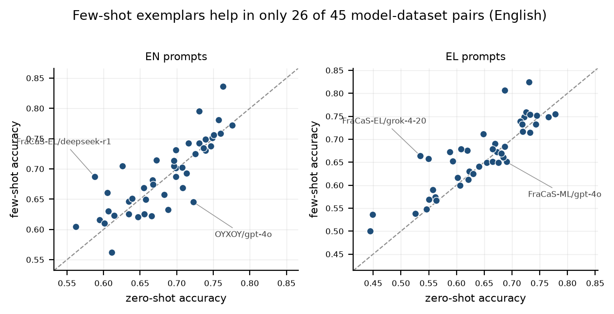
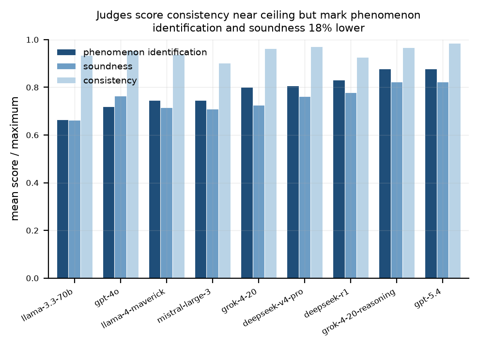
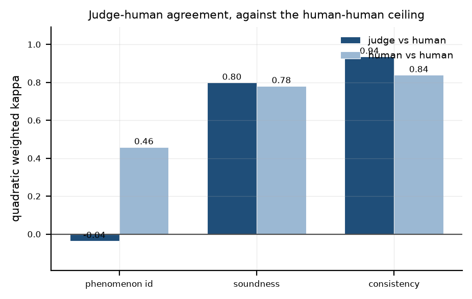
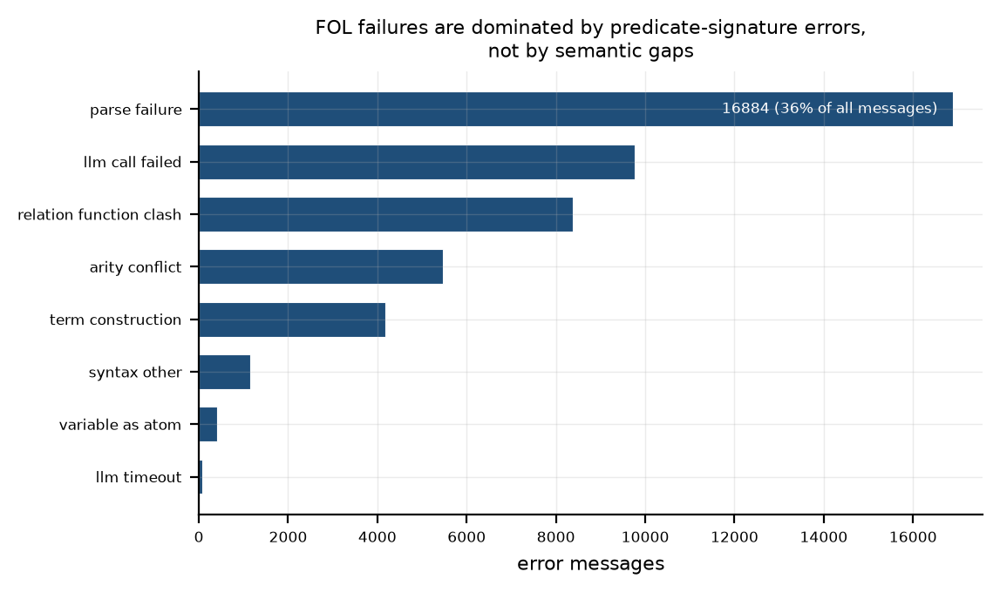
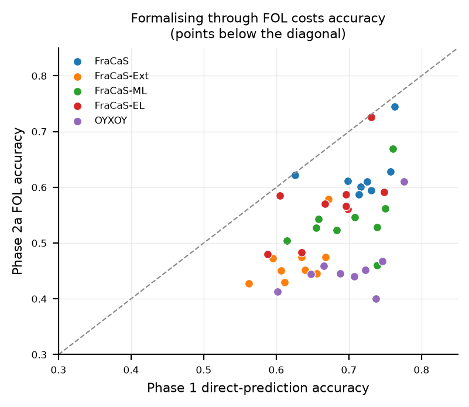
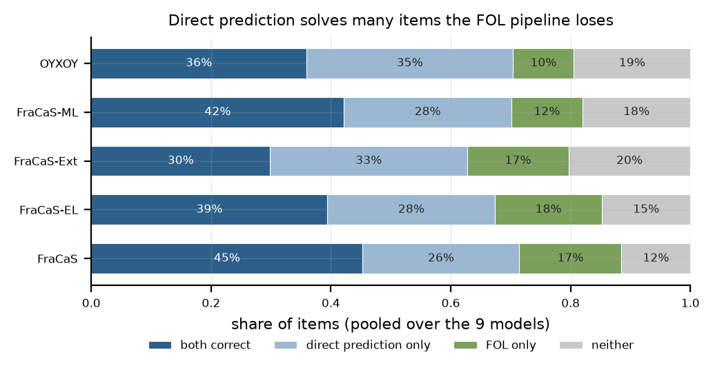

# NESTOR: Neurosymbolic Evaluation of Semantic Textual Reasoning

*Draft generated from computed tables. Every figure in the text is read from `analysis/tables/`; re-run `analysis/make_paper.py` after new results land.*

## Abstract

We evaluate 9 large language models on natural-language
inference across 5 datasets (2,873 items) in
English and Greek, and compare direct prediction against two
neurosymbolic pipelines that translate the premise-hypothesis pair into a
formal language and hand it to an automated reasoner: first-order logic
with Prover9/MACE4, and constructive type theory with Coq.

Three findings. First, direct prediction reaches only
68.3% mean accuracy in the zero-shot English
setting, far below the ceiling implied by FraCaS's construction, and
few-shot exemplars help in only 26 of
45 model-dataset pairs. Second, routing through
first-order logic *lowers* accuracy to 51.5%: the failure is
not semantic but structural, with 38.9% of
prover errors being predicate-signature mismatches rather than genuine
inferential gaps. Third, an LLM judge scoring explanation quality agrees
with human annotators on soundness (weighted
$\kappa=0.799$) but not on whether the
licensing phenomenon was identified
($\kappa=-0.035$), a disagreement we
trace to a systematic severity offset rather than noise.

## 1. Introduction

Natural-language inference is the task of deciding whether a premise
entails a hypothesis, contradicts it, or leaves it undetermined. It is a
convenient proxy for semantic competence because the label space is tiny
while the reasoning required is not: the FraCaS suite was built precisely
to isolate individual semantic phenomena -- generalized quantifiers,
plurals, anaphora, ellipsis, adjectives, comparatives, temporal
reference, attitudes -- so that a system's profile across sections says
something about *which* parts of meaning it handles.

Large language models answer such items directly and fluently, which
makes their errors hard to interpret: a correct label may follow from a
correct derivation or from a surface heuristic, and the model's own
explanation is not independent evidence. This motivates two moves we
evaluate here. The first is to have a stronger model score the
explanation, not just the label, against the phenomenon the item is
designed to test. The second is *neurosymbolic*: use the model only as a
translator into a formal language, and let a sound reasoner decide. If
the translation is faithful, the answer inherits the reasoner's
guarantees.

We report a three-part evaluation over 9 models and
5 datasets, English and Greek. The neurosymbolic result is
negative in an informative way: the reasoner is sound, but the
translations it receives are not well-formed often enough to matter, and
the dominant failure mode is not the semantic gap one would expect but a
mechanical one -- the same predicate used with different arities or as
both relation and function within a single problem.

## 2. Experimental setup

### Datasets

| dataset | items | language |
|---|---|---|
| FraCaS | 342 | English |
| FraCaS-EL | 342 | Greek |
| FraCaS-Ext | 427 | Greek |
| FraCaS-ML | 713 | Greek |
| OYXOY | 1,049 | Greek |

FraCaS is the original English suite. `fracas-translated` is the same
342 items in Greek; `fracas-extended` and
`fracas-multilabel` extend coverage, the latter allowing an item to carry
more than one admissible label; OYXOY is an independently constructed
Greek NLI set. Total: 2,873 items.

Multi-label items require care in scoring. We report *strict* accuracy
(predicted set equals gold set) throughout; a *partial* variant, where the
prediction is a subset of gold, is computed alongside. The subset rule
reproduces the `partial_success_count` stored in the source files in 112 of
116 cases, against 44 for an overlap rule, which is why subset is used.

### Models

gpt-4o, gpt-5.4, deepseek-r1, deepseek-v4-pro, grok-4-20, grok-4-20-reasoning, llama-3.3-70b, llama-4-maverick, mistral-large-3.

Each model is run zero-shot and few-shot, with English and Greek prompts,
over every dataset: 180 runs, 103,428
scored predictions.

### Prompt tiers and conditions (Phase 2)

The formalisation prompts vary along two axes. *Tiers* control how much
formal scaffolding the model sees: T0 gives Coq syntax only; T1 adds a
Montague-style semantic library; T2 adds foundation files matched to the
FraCaS section the item comes from. *Conditions* control what the model
knows about the answer: c1 is blind; c2 supplies the model's own earlier
direct prediction; c3 supplies the gold relation. c3 is the diagnostic
that separates two abilities that c1 confounds -- formalising the pair,
and deciding the relation.

## 3. Phase 1: direct prediction

Mean strict accuracy in the zero-shot English condition is
68.3%. The best single cell is
grok-4-20-reasoning on oyxoy at
77.6%. Averaged over datasets, the strongest model is
grok-4-20-reasoning at
74.0%
and the weakest mistral-large-3 at
62.6%.
The hardest dataset is FraCaS-Ext at
62.7%,
the easiest FraCaS at
71.4%.

No model exceeds 77.6% on any dataset. FraCaS items were
constructed so that a competent reader of the relevant semantic theory
answers them reliably; the gap between that and the numbers here is the
paper's starting point.

Two results bear on prompt engineering. Few-shot exemplars help in only
26 of 45 model-dataset
pairs, with a mean delta of 0.65% -- indistinguishable
from noise at this sample size. And prompting in English about Greek data
beats prompting in Greek: 69.4% against
64.9% on the translated pair, a gap that holds
for most models.

By phenomenon, the hardest section is
Adjectives at
64.3%
and the easiest is Verbs at
78.2%.
114 predictions across all runs could not be parsed
into a label at all and are counted as incorrect.

## 4. Phase 1b: explanation quality and judge validity

A stronger model (gpt-5.4) scores each explanation on three criteria:
whether it identifies the phenomenon licensing the inference (0--2),
whether the reasoning is sound (0--2), and whether it is internally
consistent (0--1). 21,993 items were scored.

Mean scores are 1.623/2 for phenomenon
identification, 1.514/2 for soundness and
0.959/1 for consistency. The ordering matters more
than the values: consistency sits near ceiling while the two substantive
criteria are markedly lower, i.e. models produce coherent prose about the
wrong thing.

This licenses a *right for the wrong reasons* measure: items answered
correctly whose explanation fails to identify the licensing phenomenon.
That is 30.6% of correct answers at the lenient
threshold (score $<2$) and 1.3% at the strict one
(score $=0$, 205 items).

### Does the judge agree with humans?

Two annotators scored a subset by hand. On the 104
items where judge and human scores coexist, quadratic-weighted agreement is
substantial for soundness ($\kappa_w=0.799$)
and near-perfect for consistency
($\kappa_w=0.936$) -- both at or above
the human-human ceiling (0.781 and
0.839 respectively).

Phenomenon identification is the exception:
$\kappa_w=-0.035$, i.e. worse than
chance, against a human-human ceiling of
0.458. Raw agreement is nonetheless
41.3%, which is the signature of the
kappa paradox rather than of random scoring: both raters concentrate on the
top category, so chance agreement is high and kappa is unstable. The
diagnostic is the severity gap -- the difference in how often each rater
awards the maximum -- which is 0.471 here
against 0.029 for soundness. The judge is
systematically harsher on this one criterion, not noisier. Reporting kappa
alone would have misdescribed this as measurement failure.

## 5. Phase 2a: first-order logic

The FOL pipeline prompts the model to translate premise and hypothesis
into first-order logic, then runs a four-phase decision procedure:
Prover9 attempts $P \vdash H$ (entailment), then $P \vdash \neg H$
(contradiction); failing both, MACE4 searches for models of $P \wedge
\neg H$ and $P \wedge H$, and a pair of satisfiable results yields
Unknown. If no phase concludes, the item is Undecided -- a pipeline
outcome, never a correct answer.

Over 76,522 items in 134 runs, accuracy is
51.5% and the undecided rate 17.9%.
Set against direct prediction's 68.3%, the
formal route *costs* accuracy. Per-model accuracies correlate with the
same models' direct-prediction accuracy at
$r=0.507$
($p=3.8e-04$, $n=43$), so the
pipeline preserves the ranking while lowering the level.

### What actually fails

21,255 items (27.8%) produced at
least one prover or parser error, 46,306 messages in
total. Categorising them by the verbatim text of the message:

| category | messages | share |
|---|---|---|
| parse failure | 16,884 | 36.5% |
| llm call failed | 9,772 | 21.1% |
| relation function clash | 8,381 | 18.1% |
| arity conflict | 5,459 | 11.8% |
| term construction | 4,185 | 9.0% |
| syntax other | 1,151 | 2.5% |
| variable as atom | 399 | 0.9% |
| llm timeout | 75 | 0.2% |

The top three -- 18.1%,
11.8% and
9.0% -- are all the same kind of fault:
a symbol used inconsistently *within a single problem*. Together
38.9% of messages are predicate-signature
errors. Timeouts, which one might expect to dominate, are
0.2%.

This matters for where effort should go. The errors are not evidence that
the models lack the lexical semantics to bridge premise and hypothesis;
they are evidence that nothing enforces a consistent signature across the
two formulae the model emits separately. That is a fixable interface
problem, not a limit of the approach.

## 6. Phase 2b: Coq

The model emits a `.v` file declaring premises and hypothesis as
propositions and attempting `entailment : P -> H` and `contradiction : P
-> ~H`; `coqc` compiles it and the closing theorems determine the label.

Over 96,039 items in 189 runs:

| tier | items | compiled | proof closed | accuracy |
|---|---|---|---|---|
| T0 | 77571 | 69.0% | 39.2% | 47.2% |
| T1 | 9234 | 67.9% | 44.1% | 51.2% |
| T2 | 9234 | 67.1% | 43.6% | 50.7% |

See `analysis/tables/coq_error_taxonomy.csv` for the residual failures.

## 7. Cross-pipeline analysis

Joining the two pipelines per item (284,739 items, zero-shot
English) partitions them four ways: both correct
39.5%, direct prediction only
29.9%, FOL only 14.1%,
neither 16.5%.

The interesting cell is FOL-only at 14.1%: items the
formal route gets right and direct prediction does not. It is smaller than
the reverse (29.9%), which is why the aggregate
accuracy is lower -- but it is not empty, so the pipelines are not nested.
A system that could route each item to the better method would beat both.

Judge scores barely predict formalisation success. Soundness correlates
with FOL correctness at $r=0.114$
($p=0.0e+00$) and phenomenon
identification at $r=-0.036$ --
statistically distinguishable from zero on tens of thousands of items, and
too small to be useful. Producing a good explanation and producing a
well-typed formula are close to independent abilities.

## 8. Limitations

**Judge coverage is partial.** Judge scores exist for 36 of 45
dataset-model cells, and the human-annotated subset is FraCaS zero-shot
English only (104 items with both judge and human
scores). The agreement figures are therefore about that slice, not the
whole grid.

**One annotator dominates.** Only one file was scored by both annotators,
so the human-human ceiling rests on 200 paired
items from a single overlap.

**Section metadata is missing for `fracas-extended`.** None of its 427
items carry section labels, so it is absent from every by-phenomenon
analysis.

**Undecided is not a wrong answer in the usual sense.** The FOL pipeline
returns it when no phase concludes; it is scored incorrect throughout, but
it reflects prover budget as much as translation quality.

**Prices and token counts.** Cost figures come from measured prompt sizes
and a retry factor measured on completed runs; they are list prices at the
time of writing.

## Figures

![Zero-shot English strict accuracy by model and dataset. The colour scale spans the observed range, not [0,1].](../analysis/figs/phase1_accuracy_heatmap.png)

**phase1_accuracy_heatmap.png** — Zero-shot English strict accuracy by model and dataset. The colour scale spans the observed range, not [0,1].

**zeroshot_vs_fewshot.png** — Few-shot against zero-shot accuracy. Points on the diagonal are unaffected by exemplars.

**judge_criteria.png** — Judge scores by criterion, normalised to each criterion's maximum.

**kappa_by_criterion.png** — Judge-human agreement against the human-human ceiling. Phenomenon identification is the outlier.

**fol_error_taxonomy.png** — Prover and parser error messages by category.

**fol_vs_phase1.png** — FOL pipeline accuracy against direct-prediction accuracy. Points below the diagonal lose accuracy by formalising.

**cross_pipeline_flow.png** — Per-item outcome partition, pooled over models.
